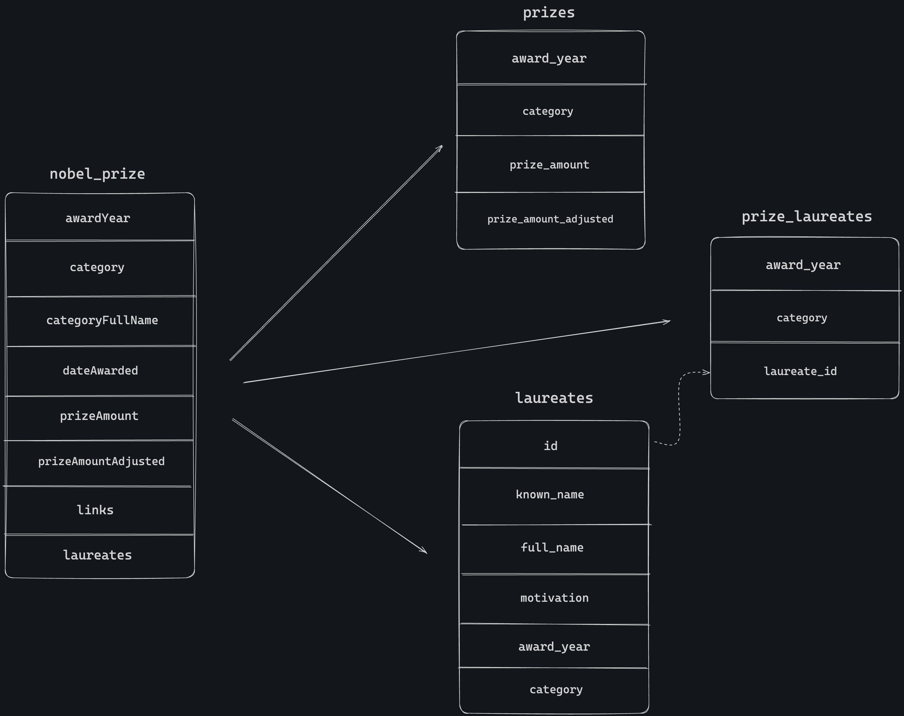

# Project Setup Guide

## Overview
This Repository is part of the bunker data engineer take home assignment. what this repo does is
1. Setup Airflow and Jupyter Notebook
2. extract data from [Nobel Prize API](https://app.swaggerhub.com/apis/NobelMedia/NobelMasterData/2.1#/default/get_nobelPrizes)
2. transform and store the data in csv file format that are in 3NF
3. a SQL query will be provided inside the `nobel_prize.ipynb` notebook to get the individuals who have won the most nobel awards (you'll able to explore more on the transformed tables)

## Prerequisites

- Ensure you have Docker installed on your machine. If not, you can download and install it from [Docker's official site](https://www.docker.com/products/docker-desktop).

## Run fromcAirflow UI
1. Go to http://localhost:8080/
2. Login with this information
    - username -> airflow
    - password -> airflow
3. CMD + f / CTRL + f and search for `nobel_prize` DAG

## Steps to Setup the Project

1. **Run Docker Compose**
   
   Run the following command to start up the Docker containers:
   ```sh
    make up
2. **Test the pipeline in local**

   Run the following command for execution test the airflow task directly from from the Airflow worker
   ```sh
    make test
    ```
3. **Explore the data**
   
    Run the following command to explore of the transformed data:
    ```sh
    make explore
4. **Shutdown the project**

    If anything with the docker container you can simply run this following command
    ```sh
    make restart
    ```
5. **Shutdown the project**

    to stop all running docker containers you just need to run the below command to stop all running contrainers
    ```sh
    make down
    ```
## Summary
Overall this project is built in one repository which means that this design is just for this specific task. At the production level, of course we have to standardize code organization, OOP design, project structure and so on. It depends on User requirements, team goals, and following existing best practices. Here is a [list of improvements](ROADMAP.md) that I think will make our lives easier to make these pipelines more efficient, robust, and automated 

## Result on Airflow UI


## Table transformation diagram


